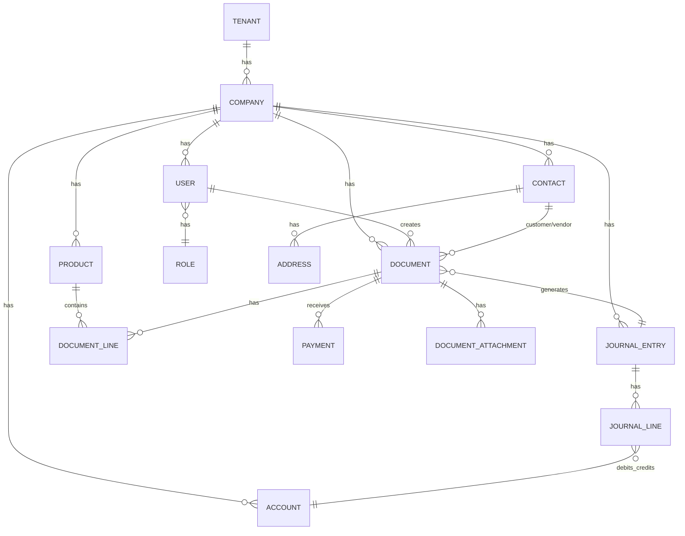

# Database Schema Design (PostgreSQL)

ออกแบบโครงสร้างฐานข้อมูลสำหรับระบบบัญชีครบวงจร

---

## 📊 Entity Relationship Diagram (ERD)

### Core Entities Overview



---

## 🏢 1. Multi-Tenant & Company

### 1.1 tenants (ผู้เช่าระบบ - SaaS)
```sql
CREATE TABLE tenants (
    id UUID PRIMARY KEY DEFAULT gen_random_uuid(),
    name VARCHAR(255) NOT NULL,
    slug VARCHAR(100) UNIQUE NOT NULL,
    plan VARCHAR(50) DEFAULT 'free', -- free, starter, pro, enterprise
    status VARCHAR(20) DEFAULT 'active', -- active, suspended, cancelled
    trial_ends_at TIMESTAMP,
    subscription_ends_at TIMESTAMP,
    settings JSONB DEFAULT '{}',
    created_at TIMESTAMP DEFAULT NOW(),
    updated_at TIMESTAMP DEFAULT NOW()
);

CREATE INDEX idx_tenants_slug ON tenants(slug);
CREATE INDEX idx_tenants_status ON tenants(status);
```

### 1.2 companies (บริษัท)
```sql
CREATE TABLE companies (
    id UUID PRIMARY KEY DEFAULT gen_random_uuid(),
    tenant_id UUID NOT NULL REFERENCES tenants(id),
    
    -- Basic Info
    name VARCHAR(255) NOT NULL,
    name_en VARCHAR(255),
    tax_id VARCHAR(20), -- เลขประจำตัวผู้เสียภาษี 13 หลัก
    branch_code VARCHAR(10) DEFAULT '00000', -- รหัสสาขา
    
    -- Contact
    phone VARCHAR(50),
    email VARCHAR(255),
    website VARCHAR(255),
    
    -- Address
    address TEXT,
    district VARCHAR(100),
    sub_district VARCHAR(100),
    province VARCHAR(100),
    postal_code VARCHAR(10),
    country VARCHAR(100) DEFAULT 'Thailand',
    
    -- Settings
    fiscal_year_start INTEGER DEFAULT 1, -- 1 = January
    default_currency VARCHAR(3) DEFAULT 'THB',
    vat_registered BOOLEAN DEFAULT TRUE,
    vat_rate DECIMAL(5,2) DEFAULT 7.00,
    logo_url VARCHAR(500),
    
    -- Document Settings
    document_settings JSONB DEFAULT '{}',
    
    is_active BOOLEAN DEFAULT TRUE,
    created_at TIMESTAMP DEFAULT NOW(),
    updated_at TIMESTAMP DEFAULT NOW()
);

CREATE INDEX idx_companies_tenant ON companies(tenant_id);
CREATE INDEX idx_companies_tax_id ON companies(tax_id);
```

---

## 👥 2. Users & Roles

### 2.1 users (ผู้ใช้งาน)
```sql
CREATE TABLE users (
    id UUID PRIMARY KEY DEFAULT gen_random_uuid(),
    tenant_id UUID NOT NULL REFERENCES tenants(id),
    
    -- Authentication
    email VARCHAR(255) NOT NULL,
    password_hash VARCHAR(255),
    
    -- Profile
    first_name VARCHAR(100) NOT NULL,
    last_name VARCHAR(100) NOT NULL,
    phone VARCHAR(50),
    avatar_url VARCHAR(500),
    
    -- Settings
    language VARCHAR(10) DEFAULT 'th',
    timezone VARCHAR(50) DEFAULT 'Asia/Bangkok',
    date_format VARCHAR(20) DEFAULT 'DD/MM/YYYY',
    
    -- Security
    two_factor_enabled BOOLEAN DEFAULT FALSE,
    two_factor_secret VARCHAR(255),
    last_login_at TIMESTAMP,
    last_login_ip VARCHAR(50),
    failed_login_attempts INTEGER DEFAULT 0,
    locked_until TIMESTAMP,
    
    -- Status
    status VARCHAR(20) DEFAULT 'active', -- active, inactive, suspended
    email_verified_at TIMESTAMP,
    
    created_at TIMESTAMP DEFAULT NOW(),
    updated_at TIMESTAMP DEFAULT NOW(),
    
    UNIQUE(tenant_id, email)
);

CREATE INDEX idx_users_tenant ON users(tenant_id);
CREATE INDEX idx_users_email ON users(email);
CREATE INDEX idx_users_status ON users(status);
```

### 2.2 roles (บทบาท)
```sql
CREATE TABLE roles (
    id UUID PRIMARY KEY DEFAULT gen_random_uuid(),
    tenant_id UUID REFERENCES tenants(id), -- NULL = system role
    
    name VARCHAR(100) NOT NULL,
    description TEXT,
    is_system BOOLEAN DEFAULT FALSE, -- true = built-in role
    
    created_at TIMESTAMP DEFAULT NOW(),
    updated_at TIMESTAMP DEFAULT NOW()
);

-- Pre-defined roles
INSERT INTO roles (id, name, description, is_system) VALUES
    ('00000000-0000-0000-0000-000000000001', 'owner', 'เจ้าของบริษัท - สิทธิ์เต็ม', TRUE),
    ('00000000-0000-0000-0000-000000000002', 'admin', 'ผู้ดูแลระบบ', TRUE),
    ('00000000-0000-0000-0000-000000000003', 'accountant', 'นักบัญชี', TRUE),
    ('00000000-0000-0000-0000-000000000004', 'sales', 'ฝ่ายขาย', TRUE),
    ('00000000-0000-0000-0000-000000000005', 'purchasing', 'ฝ่ายจัดซื้อ', TRUE),
    ('00000000-0000-0000-0000-000000000006', 'hr', 'ฝ่ายบุคคล', TRUE),
    ('00000000-0000-0000-0000-000000000007', 'viewer', 'ดูอย่างเดียว', TRUE);
```

### 2.3 permissions (สิทธิ์)
```sql
CREATE TABLE permissions (
    id UUID PRIMARY KEY DEFAULT gen_random_uuid(),
    module VARCHAR(50) NOT NULL, -- contacts, products, invoices, etc.
    action VARCHAR(50) NOT NULL, -- view, create, edit, delete, approve, export
    description TEXT,
    
    UNIQUE(module, action)
);

-- Example permissions
INSERT INTO permissions (module, action, description) VALUES
    ('contacts', 'view', 'ดูรายชื่อลูกค้า/Vendor'),
    ('contacts', 'create', 'สร้างลูกค้า/Vendor ใหม่'),
    ('contacts', 'edit', 'แก้ไขลูกค้า/Vendor'),
    ('contacts', 'delete', 'ลบลูกค้า/Vendor'),
    ('invoices', 'view', 'ดูใบแจ้งหนี้'),
    ('invoices', 'create', 'สร้างใบแจ้งหนี้'),
    ('invoices', 'edit', 'แก้ไขใบแจ้งหนี้'),
    ('invoices', 'delete', 'ลบใบแจ้งหนี้'),
    ('invoices', 'approve', 'อนุมัติใบแจ้งหนี้'),
    ('reports', 'view', 'ดูรายงาน'),
    ('reports', 'export', 'Export รายงาน');
```

### 2.4 role_permissions (สิทธิ์ของบทบาท)
```sql
CREATE TABLE role_permissions (
    role_id UUID REFERENCES roles(id) ON DELETE CASCADE,
    permission_id UUID REFERENCES permissions(id) ON DELETE CASCADE,
    
    PRIMARY KEY (role_id, permission_id)
);
```

### 2.5 user_companies (ผู้ใช้-บริษัท)
```sql
CREATE TABLE user_companies (
    id UUID PRIMARY KEY DEFAULT gen_random_uuid(),
    user_id UUID NOT NULL REFERENCES users(id) ON DELETE CASCADE,
    company_id UUID NOT NULL REFERENCES companies(id) ON DELETE CASCADE,
    role_id UUID NOT NULL REFERENCES roles(id),
    
    -- Additional restrictions
    branch_access JSONB, -- NULL = all branches
    amount_limit DECIMAL(15,2), -- NULL = no limit
    
    is_default BOOLEAN DEFAULT FALSE,
    
    created_at TIMESTAMP DEFAULT NOW(),
    
    UNIQUE(user_id, company_id)
);

CREATE INDEX idx_user_companies_user ON user_companies(user_id);
CREATE INDEX idx_user_companies_company ON user_companies(company_id);
```

---

## 📇 3. Contacts (ลูกค้า/Vendor)

### 3.1 contacts
```sql
CREATE TABLE contacts (
    id UUID PRIMARY KEY DEFAULT gen_random_uuid(),
    company_id UUID NOT NULL REFERENCES companies(id),
    
    -- Type
    type VARCHAR(20) NOT NULL, -- customer, vendor, both
    
    -- Basic Info
    code VARCHAR(50), -- รหัสลูกค้า
    name VARCHAR(255) NOT NULL,
    name_en VARCHAR(255),
    tax_id VARCHAR(20),
    branch_code VARCHAR(10) DEFAULT '00000',
    
    -- Contact Person
    contact_name VARCHAR(255),
    phone VARCHAR(50),
    email VARCHAR(255),
    
    -- Terms
    credit_term INTEGER DEFAULT 30, -- วันเครดิต
    credit_limit DECIMAL(15,2), -- วงเงินเครดิต
    
    -- Tax Settings
    default_wht_rate DECIMAL(5,2), -- อัตราหัก ณ ที่จ่ายเริ่มต้น
    
    -- Tags & Notes
    tags JSONB DEFAULT '[]',
    notes TEXT,
    
    -- Status
    is_active BOOLEAN DEFAULT TRUE,
    is_blacklisted BOOLEAN DEFAULT FALSE,
    
    created_at TIMESTAMP DEFAULT NOW(),
    updated_at TIMESTAMP DEFAULT NOW(),
    created_by UUID REFERENCES users(id)
);

CREATE INDEX idx_contacts_company ON contacts(company_id);
CREATE INDEX idx_contacts_type ON contacts(type);
CREATE INDEX idx_contacts_code ON contacts(company_id, code);
CREATE INDEX idx_contacts_tax_id ON contacts(tax_id);
```

### 3.2 contact_addresses (ที่อยู่)
```sql
CREATE TABLE contact_addresses (
    id UUID PRIMARY KEY DEFAULT gen_random_uuid(),
    contact_id UUID NOT NULL REFERENCES contacts(id) ON DELETE CASCADE,
    
    type VARCHAR(50) NOT NULL, -- billing, shipping, head_office, branch
    label VARCHAR(100), -- ชื่อที่อยู่ เช่น "สำนักงานใหญ่"
    
    address TEXT NOT NULL,
    district VARCHAR(100),
    sub_district VARCHAR(100),
    province VARCHAR(100),
    postal_code VARCHAR(10),
    country VARCHAR(100) DEFAULT 'Thailand',
    
    is_default BOOLEAN DEFAULT FALSE,
    
    created_at TIMESTAMP DEFAULT NOW()
);

CREATE INDEX idx_contact_addresses_contact ON contact_addresses(contact_id);
```

---

## 📦 4. Products & Services

### 4.1 product_categories (หมวดหมู่สินค้า)
```sql
CREATE TABLE product_categories (
    id UUID PRIMARY KEY DEFAULT gen_random_uuid(),
    company_id UUID NOT NULL REFERENCES companies(id),
    parent_id UUID REFERENCES product_categories(id),
    
    name VARCHAR(255) NOT NULL,
    description TEXT,
    
    created_at TIMESTAMP DEFAULT NOW()
);

CREATE INDEX idx_product_categories_company ON product_categories(company_id);
```

### 4.2 products
```sql
CREATE TABLE products (
    id UUID PRIMARY KEY DEFAULT gen_random_uuid(),
    company_id UUID NOT NULL REFERENCES companies(id),
    category_id UUID REFERENCES product_categories(id),
    
    -- Type
    type VARCHAR(20) NOT NULL, -- product, service, bundle
    
    -- Basic Info
    code VARCHAR(100), -- SKU
    barcode VARCHAR(100),
    name VARCHAR(255) NOT NULL,
    name_en VARCHAR(255),
    description TEXT,
    
    -- Pricing
    unit VARCHAR(50), -- ชิ้น, กล่อง, ชั่วโมง
    sale_price DECIMAL(15,2) DEFAULT 0,
    purchase_price DECIMAL(15,2) DEFAULT 0,
    
    -- Tax
    is_vatable BOOLEAN DEFAULT TRUE,
    vat_type VARCHAR(20) DEFAULT 'vat7', -- vat7, vat0, non_vat
    
    -- Inventory (for products only)
    track_inventory BOOLEAN DEFAULT FALSE,
    min_stock DECIMAL(15,2) DEFAULT 0,
    
    -- Accounting
    income_account_id UUID REFERENCES accounts(id),
    expense_account_id UUID REFERENCES accounts(id),
    inventory_account_id UUID REFERENCES accounts(id),
    
    -- Image
    image_url VARCHAR(500),
    
    is_active BOOLEAN DEFAULT TRUE,
    
    created_at TIMESTAMP DEFAULT NOW(),
    updated_at TIMESTAMP DEFAULT NOW()
);

CREATE INDEX idx_products_company ON products(company_id);
CREATE INDEX idx_products_code ON products(company_id, code);
CREATE INDEX idx_products_barcode ON products(barcode);
CREATE INDEX idx_products_type ON products(type);
```

### 4.3 product_units (หน่วยนับ)
```sql
CREATE TABLE product_units (
    id UUID PRIMARY KEY DEFAULT gen_random_uuid(),
    product_id UUID NOT NULL REFERENCES products(id) ON DELETE CASCADE,
    
    unit VARCHAR(50) NOT NULL, -- ลัง, โหล
    conversion_rate DECIMAL(15,4) NOT NULL, -- 1 ลัง = 12 ชิ้น
    barcode VARCHAR(100),
    sale_price DECIMAL(15,2),
    
    is_default BOOLEAN DEFAULT FALSE,
    
    created_at TIMESTAMP DEFAULT NOW()
);

CREATE INDEX idx_product_units_product ON product_units(product_id);
```

---

## 📒 5. Chart of Accounts (ผังบัญชี)

### 5.1 account_types (ประเภทบัญชี)
```sql
CREATE TABLE account_types (
    id UUID PRIMARY KEY DEFAULT gen_random_uuid(),
    
    code VARCHAR(10) NOT NULL UNIQUE, -- 1, 2, 3, 4, 5
    name VARCHAR(100) NOT NULL,
    name_en VARCHAR(100),
    normal_balance VARCHAR(10) NOT NULL, -- debit, credit
    
    display_order INTEGER
);

INSERT INTO account_types (code, name, name_en, normal_balance, display_order) VALUES
    ('1', 'สินทรัพย์', 'Assets', 'debit', 1),
    ('2', 'หนี้สิน', 'Liabilities', 'credit', 2),
    ('3', 'ส่วนของผู้ถือหุ้น', 'Equity', 'credit', 3),
    ('4', 'รายได้', 'Revenue', 'credit', 4),
    ('5', 'ค่าใช้จ่าย', 'Expenses', 'debit', 5);
```

### 5.2 accounts (ผังบัญชี)
```sql
CREATE TABLE accounts (
    id UUID PRIMARY KEY DEFAULT gen_random_uuid(),
    company_id UUID NOT NULL REFERENCES companies(id),
    account_type_id UUID NOT NULL REFERENCES account_types(id),
    parent_id UUID REFERENCES accounts(id),
    
    -- Basic Info
    code VARCHAR(20) NOT NULL,
    name VARCHAR(255) NOT NULL,
    name_en VARCHAR(255),
    description TEXT,
    
    -- Settings
    is_header BOOLEAN DEFAULT FALSE, -- หัวบัญชี (ไม่ลงรายการ)
    is_system BOOLEAN DEFAULT FALSE, -- บัญชีระบบ (ลบไม่ได้)
    is_bank BOOLEAN DEFAULT FALSE, -- บัญชีธนาคาร
    
    -- Bank Info (if is_bank)
    bank_name VARCHAR(100),
    bank_branch VARCHAR(100),
    bank_account_number VARCHAR(50),
    
    is_active BOOLEAN DEFAULT TRUE,
    
    created_at TIMESTAMP DEFAULT NOW(),
    updated_at TIMESTAMP DEFAULT NOW(),
    
    UNIQUE(company_id, code)
);

CREATE INDEX idx_accounts_company ON accounts(company_id);
CREATE INDEX idx_accounts_type ON accounts(account_type_id);
CREATE INDEX idx_accounts_code ON accounts(company_id, code);
```

---

## 📄 6. Documents (เอกสาร)

### 6.1 document_types (ประเภทเอกสาร)
```sql
CREATE TABLE document_types (
    id UUID PRIMARY KEY DEFAULT gen_random_uuid(),
    
    code VARCHAR(50) NOT NULL UNIQUE,
    name VARCHAR(100) NOT NULL,
    name_en VARCHAR(100),
    category VARCHAR(50) NOT NULL, -- sales, purchase, inventory, journal
    
    -- Flow settings
    can_convert_to JSONB DEFAULT '[]', -- ["invoice", "receipt"]
    
    display_order INTEGER
);

INSERT INTO document_types (code, name, name_en, category, can_convert_to, display_order) VALUES
    ('quotation', 'ใบเสนอราคา', 'Quotation', 'sales', '["invoice", "sales_order"]', 1),
    ('sales_order', 'ใบสั่งขาย', 'Sales Order', 'sales', '["invoice", "delivery_note"]', 2),
    ('invoice', 'ใบแจ้งหนี้/ใบกำกับภาษี', 'Invoice/Tax Invoice', 'sales', '["receipt"]', 3),
    ('receipt', 'ใบเสร็จรับเงิน', 'Receipt', 'sales', '[]', 4),
    ('credit_note', 'ใบลดหนี้', 'Credit Note', 'sales', '[]', 5),
    ('debit_note', 'ใบเพิ่มหนี้', 'Debit Note', 'sales', '[]', 6),
    
    ('purchase_request', 'ใบขอซื้อ', 'Purchase Request', 'purchase', '["purchase_order"]', 10),
    ('purchase_order', 'ใบสั่งซื้อ', 'Purchase Order', 'purchase', '["goods_receipt"]', 11),
    ('goods_receipt', 'ใบรับสินค้า', 'Goods Receipt', 'purchase', '["purchase_invoice"]', 12),
    ('purchase_invoice', 'บันทึกซื้อ', 'Purchase Invoice', 'purchase', '["payment"]', 13),
    ('payment', 'ใบสำคัญจ่าย', 'Payment Voucher', 'purchase', '[]', 14),
    
    ('expense', 'ค่าใช้จ่าย', 'Expense', 'purchase', '[]', 20),
    
    ('journal_voucher', 'ใบสำคัญทั่วไป', 'Journal Voucher', 'journal', '[]', 30);
```

### 6.2 documents (เอกสาร)
```sql
CREATE TABLE documents (
    id UUID PRIMARY KEY DEFAULT gen_random_uuid(),
    company_id UUID NOT NULL REFERENCES companies(id),
    document_type_id UUID NOT NULL REFERENCES document_types(id),
    
    -- Document Number
    document_number VARCHAR(50) NOT NULL,
    reference_number VARCHAR(50), -- เลขอ้างอิง/เลขใบกำกับภาษี
    
    -- Contact
    contact_id UUID REFERENCES contacts(id),
    contact_name VARCHAR(255), -- Snapshot
    contact_address TEXT, -- Snapshot
    contact_tax_id VARCHAR(20), -- Snapshot
    
    -- Dates
    document_date DATE NOT NULL,
    due_date DATE,
    
    -- Amounts
    subtotal DECIMAL(15,2) DEFAULT 0,
    discount_amount DECIMAL(15,2) DEFAULT 0,
    amount_before_vat DECIMAL(15,2) DEFAULT 0,
    vat_amount DECIMAL(15,2) DEFAULT 0,
    wht_amount DECIMAL(15,2) DEFAULT 0, -- ภาษีหัก ณ ที่จ่าย
    total_amount DECIMAL(15,2) DEFAULT 0,
    
    -- Currency
    currency VARCHAR(3) DEFAULT 'THB',
    exchange_rate DECIMAL(15,6) DEFAULT 1,
    
    -- Status
    status VARCHAR(30) DEFAULT 'draft',
    -- draft, awaiting_approval, approved, sent, viewed, 
    -- partial_paid, paid, overdue, voided, cancelled
    
    -- Payment
    paid_amount DECIMAL(15,2) DEFAULT 0,
    
    -- Related Documents
    source_document_id UUID REFERENCES documents(id), -- เอกสารต้นทาง
    
    -- Accounting
    journal_entry_id UUID REFERENCES journal_entries(id),
    
    -- Notes
    notes TEXT, -- หมายเหตุภายใน
    customer_notes TEXT, -- หมายเหตุแสดงในเอกสาร
    
    -- Tracking
    sent_at TIMESTAMP,
    viewed_at TIMESTAMP,
    
    -- Void
    voided_at TIMESTAMP,
    void_reason TEXT,
    
    created_at TIMESTAMP DEFAULT NOW(),
    updated_at TIMESTAMP DEFAULT NOW(),
    created_by UUID REFERENCES users(id),
    approved_by UUID REFERENCES users(id),
    approved_at TIMESTAMP,
    
    UNIQUE(company_id, document_type_id, document_number)
);

CREATE INDEX idx_documents_company ON documents(company_id);
CREATE INDEX idx_documents_type ON documents(document_type_id);
CREATE INDEX idx_documents_contact ON documents(contact_id);
CREATE INDEX idx_documents_date ON documents(document_date);
CREATE INDEX idx_documents_status ON documents(status);
CREATE INDEX idx_documents_number ON documents(company_id, document_number);
```

### 6.3 document_lines (รายการในเอกสาร)
```sql
CREATE TABLE document_lines (
    id UUID PRIMARY KEY DEFAULT gen_random_uuid(),
    document_id UUID NOT NULL REFERENCES documents(id) ON DELETE CASCADE,
    
    line_number INTEGER NOT NULL,
    
    -- Product
    product_id UUID REFERENCES products(id),
    product_code VARCHAR(100), -- Snapshot
    product_name VARCHAR(255) NOT NULL, -- Snapshot or free text
    description TEXT,
    
    -- Quantity & Unit
    quantity DECIMAL(15,4) NOT NULL DEFAULT 1,
    unit VARCHAR(50),
    
    -- Pricing
    unit_price DECIMAL(15,4) NOT NULL DEFAULT 0,
    discount_percent DECIMAL(5,2) DEFAULT 0,
    discount_amount DECIMAL(15,2) DEFAULT 0,
    amount DECIMAL(15,2) DEFAULT 0, -- After discount
    
    -- Tax
    vat_type VARCHAR(20) DEFAULT 'vat7', -- vat7, vat0, non_vat
    vat_amount DECIMAL(15,2) DEFAULT 0,
    
    -- WHT
    wht_rate DECIMAL(5,2) DEFAULT 0,
    wht_amount DECIMAL(15,2) DEFAULT 0,
    
    -- Accounting
    account_id UUID REFERENCES accounts(id),
    
    created_at TIMESTAMP DEFAULT NOW()
);

CREATE INDEX idx_document_lines_document ON document_lines(document_id);
CREATE INDEX idx_document_lines_product ON document_lines(product_id);
```

### 6.4 document_attachments (ไฟล์แนบ)
```sql
CREATE TABLE document_attachments (
    id UUID PRIMARY KEY DEFAULT gen_random_uuid(),
    document_id UUID NOT NULL REFERENCES documents(id) ON DELETE CASCADE,
    
    file_name VARCHAR(255) NOT NULL,
    file_type VARCHAR(50),
    file_size INTEGER,
    file_url VARCHAR(500) NOT NULL,
    
    uploaded_by UUID REFERENCES users(id),
    uploaded_at TIMESTAMP DEFAULT NOW()
);

CREATE INDEX idx_document_attachments_document ON document_attachments(document_id);
```

### 6.5 document_activities (ประวัติกิจกรรม)
```sql
CREATE TABLE document_activities (
    id UUID PRIMARY KEY DEFAULT gen_random_uuid(),
    document_id UUID NOT NULL REFERENCES documents(id) ON DELETE CASCADE,
    
    activity_type VARCHAR(50) NOT NULL, 
    -- created, updated, approved, rejected, sent, viewed, paid, voided
    
    description TEXT,
    metadata JSONB DEFAULT '{}',
    
    performed_by UUID REFERENCES users(id),
    performed_at TIMESTAMP DEFAULT NOW()
);

CREATE INDEX idx_document_activities_document ON document_activities(document_id);
CREATE INDEX idx_document_activities_type ON document_activities(activity_type);
```

---

## 💰 7. Payments (การชำระเงิน)

### 7.1 payments
```sql
CREATE TABLE payments (
    id UUID PRIMARY KEY DEFAULT gen_random_uuid(),
    company_id UUID NOT NULL REFERENCES companies(id),
    
    -- Type
    type VARCHAR(20) NOT NULL, -- receive (รับเงิน), pay (จ่ายเงิน)
    
    -- Reference
    payment_number VARCHAR(50) NOT NULL,
    
    -- Contact
    contact_id UUID REFERENCES contacts(id),
    
    -- Amount
    amount DECIMAL(15,2) NOT NULL,
    currency VARCHAR(3) DEFAULT 'THB',
    
    -- Method
    payment_method VARCHAR(50) NOT NULL, -- cash, transfer, cheque, credit_card
    
    -- Bank Info
    bank_account_id UUID REFERENCES accounts(id), -- บัญชีธนาคาร
    reference_number VARCHAR(100), -- เลขอ้างอิงการโอน
    
    -- Cheque Info
    cheque_number VARCHAR(50),
    cheque_date DATE,
    cheque_bank VARCHAR(100),
    
    -- Date
    payment_date DATE NOT NULL,
    
    -- Status
    status VARCHAR(20) DEFAULT 'completed', -- pending, completed, cancelled
    
    -- Accounting
    journal_entry_id UUID REFERENCES journal_entries(id),
    
    notes TEXT,
    
    created_at TIMESTAMP DEFAULT NOW(),
    created_by UUID REFERENCES users(id),
    
    UNIQUE(company_id, payment_number)
);

CREATE INDEX idx_payments_company ON payments(company_id);
CREATE INDEX idx_payments_contact ON payments(contact_id);
CREATE INDEX idx_payments_date ON payments(payment_date);
```

### 7.2 payment_allocations (การจับคู่ชำระ)
```sql
CREATE TABLE payment_allocations (
    id UUID PRIMARY KEY DEFAULT gen_random_uuid(),
    payment_id UUID NOT NULL REFERENCES payments(id) ON DELETE CASCADE,
    document_id UUID NOT NULL REFERENCES documents(id),
    
    amount DECIMAL(15,2) NOT NULL,
    wht_amount DECIMAL(15,2) DEFAULT 0, -- หัก ณ ที่จ่าย
    
    created_at TIMESTAMP DEFAULT NOW()
);

CREATE INDEX idx_payment_allocations_payment ON payment_allocations(payment_id);
CREATE INDEX idx_payment_allocations_document ON payment_allocations(document_id);
```

---

## 📒 8. Journal Entries (บันทึกบัญชี)

### 8.1 journal_entries
```sql
CREATE TABLE journal_entries (
    id UUID PRIMARY KEY DEFAULT gen_random_uuid(),
    company_id UUID NOT NULL REFERENCES companies(id),
    
    -- Reference
    entry_number VARCHAR(50) NOT NULL,
    
    -- Source
    source_type VARCHAR(50), -- document, payment, payroll, manual
    source_id UUID, -- ID ของต้นทาง
    
    -- Date
    entry_date DATE NOT NULL,
    
    -- Period
    fiscal_year INTEGER NOT NULL,
    fiscal_month INTEGER NOT NULL,
    
    -- Amounts
    total_debit DECIMAL(15,2) NOT NULL,
    total_credit DECIMAL(15,2) NOT NULL,
    
    -- Description
    description TEXT,
    
    -- Status
    status VARCHAR(20) DEFAULT 'posted', -- draft, posted, reversed
    
    -- Reversal
    is_reversal BOOLEAN DEFAULT FALSE,
    reversed_entry_id UUID REFERENCES journal_entries(id),
    
    created_at TIMESTAMP DEFAULT NOW(),
    created_by UUID REFERENCES users(id),
    
    UNIQUE(company_id, entry_number)
);

CREATE INDEX idx_journal_entries_company ON journal_entries(company_id);
CREATE INDEX idx_journal_entries_date ON journal_entries(entry_date);
CREATE INDEX idx_journal_entries_period ON journal_entries(fiscal_year, fiscal_month);
CREATE INDEX idx_journal_entries_source ON journal_entries(source_type, source_id);
```

### 8.2 journal_lines
```sql
CREATE TABLE journal_lines (
    id UUID PRIMARY KEY DEFAULT gen_random_uuid(),
    journal_entry_id UUID NOT NULL REFERENCES journal_entries(id) ON DELETE CASCADE,
    
    line_number INTEGER NOT NULL,
    
    -- Account
    account_id UUID NOT NULL REFERENCES accounts(id),
    
    -- Amount (one of these should be 0)
    debit_amount DECIMAL(15,2) DEFAULT 0,
    credit_amount DECIMAL(15,2) DEFAULT 0,
    
    -- Description
    description TEXT,
    
    -- Dimensions (optional)
    cost_center_id UUID,
    project_id UUID,
    
    -- Reference
    contact_id UUID REFERENCES contacts(id),
    
    created_at TIMESTAMP DEFAULT NOW()
);

CREATE INDEX idx_journal_lines_entry ON journal_lines(journal_entry_id);
CREATE INDEX idx_journal_lines_account ON journal_lines(account_id);
```

---

## 📊 9. Inventory (สต็อก)

### 9.1 warehouses (คลังสินค้า)
```sql
CREATE TABLE warehouses (
    id UUID PRIMARY KEY DEFAULT gen_random_uuid(),
    company_id UUID NOT NULL REFERENCES companies(id),
    
    code VARCHAR(50) NOT NULL,
    name VARCHAR(255) NOT NULL,
    address TEXT,
    
    is_default BOOLEAN DEFAULT FALSE,
    is_active BOOLEAN DEFAULT TRUE,
    
    created_at TIMESTAMP DEFAULT NOW(),
    
    UNIQUE(company_id, code)
);
```

### 9.2 inventory_transactions (ธุรกรรมสต็อก)
```sql
CREATE TABLE inventory_transactions (
    id UUID PRIMARY KEY DEFAULT gen_random_uuid(),
    company_id UUID NOT NULL REFERENCES companies(id),
    warehouse_id UUID NOT NULL REFERENCES warehouses(id),
    product_id UUID NOT NULL REFERENCES products(id),
    
    -- Type
    transaction_type VARCHAR(50) NOT NULL, 
    -- sale, purchase, adjustment, transfer_in, transfer_out
    
    -- Reference
    reference_type VARCHAR(50), -- document, stock_adjustment
    reference_id UUID,
    
    -- Quantity
    quantity DECIMAL(15,4) NOT NULL, -- + = in, - = out
    unit VARCHAR(50),
    
    -- Cost
    unit_cost DECIMAL(15,4),
    total_cost DECIMAL(15,2),
    
    -- Balance after transaction
    balance_quantity DECIMAL(15,4),
    balance_cost DECIMAL(15,2),
    
    -- Date
    transaction_date DATE NOT NULL,
    
    notes TEXT,
    
    created_at TIMESTAMP DEFAULT NOW(),
    created_by UUID REFERENCES users(id)
);

CREATE INDEX idx_inventory_transactions_company ON inventory_transactions(company_id);
CREATE INDEX idx_inventory_transactions_product ON inventory_transactions(product_id);
CREATE INDEX idx_inventory_transactions_warehouse ON inventory_transactions(warehouse_id);
CREATE INDEX idx_inventory_transactions_date ON inventory_transactions(transaction_date);
```

### 9.3 inventory_balances (ยอดคงเหลือ - Materialized View)
```sql
CREATE TABLE inventory_balances (
    id UUID PRIMARY KEY DEFAULT gen_random_uuid(),
    company_id UUID NOT NULL REFERENCES companies(id),
    warehouse_id UUID NOT NULL REFERENCES warehouses(id),
    product_id UUID NOT NULL REFERENCES products(id),
    
    quantity DECIMAL(15,4) DEFAULT 0,
    average_cost DECIMAL(15,4) DEFAULT 0,
    total_cost DECIMAL(15,2) DEFAULT 0,
    
    last_updated_at TIMESTAMP DEFAULT NOW(),
    
    UNIQUE(company_id, warehouse_id, product_id)
);

CREATE INDEX idx_inventory_balances_product ON inventory_balances(product_id);
```

---

## 💵 10. Tax (ภาษี)

### 10.1 withholding_tax_certificates (หนังสือรับรองหัก ณ ที่จ่าย - 50 ทวิ)
```sql
CREATE TABLE withholding_tax_certificates (
    id UUID PRIMARY KEY DEFAULT gen_random_uuid(),
    company_id UUID NOT NULL REFERENCES companies(id),
    
    -- Certificate Info
    certificate_number VARCHAR(50) NOT NULL,
    certificate_date DATE NOT NULL,
    
    -- Type
    type VARCHAR(20) NOT NULL, -- issued (ออกให้คนอื่น), received (ถูกหัก)
    
    -- Payer/Payee
    contact_id UUID REFERENCES contacts(id),
    contact_name VARCHAR(255) NOT NULL,
    contact_address TEXT,
    contact_tax_id VARCHAR(20),
    
    -- Tax Period
    tax_month INTEGER NOT NULL,
    tax_year INTEGER NOT NULL,
    
    -- Income Type
    income_type VARCHAR(10) NOT NULL, -- 1-6 ตามแบบ
    income_description VARCHAR(255),
    
    -- Amounts
    income_amount DECIMAL(15,2) NOT NULL,
    wht_rate DECIMAL(5,2) NOT NULL,
    wht_amount DECIMAL(15,2) NOT NULL,
    
    -- Related Document
    document_id UUID REFERENCES documents(id),
    payment_id UUID REFERENCES payments(id),
    
    -- Status
    status VARCHAR(20) DEFAULT 'active', -- active, cancelled
    
    -- Physical Document Tracking
    original_received BOOLEAN DEFAULT FALSE, -- ได้รับตัวจริงแล้ว
    original_received_date DATE,
    
    created_at TIMESTAMP DEFAULT NOW(),
    created_by UUID REFERENCES users(id),
    
    UNIQUE(company_id, certificate_number)
);

CREATE INDEX idx_wht_certificates_company ON withholding_tax_certificates(company_id);
CREATE INDEX idx_wht_certificates_contact ON withholding_tax_certificates(contact_id);
CREATE INDEX idx_wht_certificates_period ON withholding_tax_certificates(tax_year, tax_month);
```

### 10.2 vat_reports (รายงานภาษีมูลค่าเพิ่ม)
```sql
CREATE TABLE vat_reports (
    id UUID PRIMARY KEY DEFAULT gen_random_uuid(),
    company_id UUID NOT NULL REFERENCES companies(id),
    
    -- Period
    tax_month INTEGER NOT NULL,
    tax_year INTEGER NOT NULL,
    
    -- Output Tax (ภาษีขาย)
    output_tax_base DECIMAL(15,2) DEFAULT 0,
    output_tax_amount DECIMAL(15,2) DEFAULT 0,
    
    -- Input Tax (ภาษีซื้อ)
    input_tax_base DECIMAL(15,2) DEFAULT 0,
    input_tax_amount DECIMAL(15,2) DEFAULT 0,
    input_tax_non_deductible DECIMAL(15,2) DEFAULT 0, -- ภาษีซื้อใช้ไม่ได้
    
    -- Net
    net_tax DECIMAL(15,2) DEFAULT 0, -- + = ต้องจ่าย, - = ขอคืน
    
    -- Filing
    status VARCHAR(20) DEFAULT 'draft', -- draft, filed, amended
    filed_at TIMESTAMP,
    filing_reference VARCHAR(100),
    
    created_at TIMESTAMP DEFAULT NOW(),
    updated_at TIMESTAMP DEFAULT NOW()
);

CREATE INDEX idx_vat_reports_company ON vat_reports(company_id);
CREATE INDEX idx_vat_reports_period ON vat_reports(tax_year, tax_month);
```

---

## 👥 11. Payroll (เงินเดือน)

### 11.1 employees (พนักงาน)
```sql
CREATE TABLE employees (
    id UUID PRIMARY KEY DEFAULT gen_random_uuid(),
    company_id UUID NOT NULL REFERENCES companies(id),
    user_id UUID REFERENCES users(id), -- Link to user if employee uses system
    
    -- Basic Info
    employee_code VARCHAR(50),
    title VARCHAR(20),
    first_name VARCHAR(100) NOT NULL,
    last_name VARCHAR(100) NOT NULL,
    nickname VARCHAR(50),
    
    -- ID
    citizen_id VARCHAR(20), -- เลขบัตรประชาชน
    
    -- Contact
    email VARCHAR(255),
    phone VARCHAR(50),
    address TEXT,
    
    -- Employment
    department VARCHAR(100),
    position VARCHAR(100),
    hire_date DATE,
    termination_date DATE,
    employment_type VARCHAR(50), -- full_time, part_time, contract
    
    -- Salary
    salary_type VARCHAR(20) DEFAULT 'monthly', -- monthly, daily, hourly
    base_salary DECIMAL(15,2) DEFAULT 0,
    
    -- Bank
    bank_name VARCHAR(100),
    bank_account_number VARCHAR(50),
    
    -- Tax
    tax_method VARCHAR(20) DEFAULT 'withhold', -- withhold, self
    
    -- Social Security
    sso_number VARCHAR(20), -- เลขประกันสังคม
    sso_hospital VARCHAR(255), -- โรงพยาบาลประกันสังคม
    
    -- Provident Fund
    pvd_member BOOLEAN DEFAULT FALSE,
    pvd_employee_rate DECIMAL(5,2) DEFAULT 0,
    pvd_employer_rate DECIMAL(5,2) DEFAULT 0,
    
    -- Status
    status VARCHAR(20) DEFAULT 'active', -- active, resigned, terminated
    
    created_at TIMESTAMP DEFAULT NOW(),
    updated_at TIMESTAMP DEFAULT NOW(),
    
    UNIQUE(company_id, employee_code)
);

CREATE INDEX idx_employees_company ON employees(company_id);
CREATE INDEX idx_employees_status ON employees(status);
```

### 11.2 payroll_periods (งวดเงินเดือน)
```sql
CREATE TABLE payroll_periods (
    id UUID PRIMARY KEY DEFAULT gen_random_uuid(),
    company_id UUID NOT NULL REFERENCES companies(id),
    
    period_name VARCHAR(100) NOT NULL, -- "มกราคม 2567"
    period_month INTEGER NOT NULL,
    period_year INTEGER NOT NULL,
    
    start_date DATE NOT NULL,
    end_date DATE NOT NULL,
    payment_date DATE,
    
    -- Totals
    total_employees INTEGER DEFAULT 0,
    total_gross DECIMAL(15,2) DEFAULT 0,
    total_deductions DECIMAL(15,2) DEFAULT 0,
    total_net DECIMAL(15,2) DEFAULT 0,
    total_sso_employee DECIMAL(15,2) DEFAULT 0,
    total_sso_employer DECIMAL(15,2) DEFAULT 0,
    total_wht DECIMAL(15,2) DEFAULT 0,
    
    -- Status
    status VARCHAR(20) DEFAULT 'draft', -- draft, calculated, approved, paid
    
    -- Accounting
    journal_entry_id UUID REFERENCES journal_entries(id),
    
    approved_by UUID REFERENCES users(id),
    approved_at TIMESTAMP,
    
    created_at TIMESTAMP DEFAULT NOW(),
    updated_at TIMESTAMP DEFAULT NOW()
);

CREATE INDEX idx_payroll_periods_company ON payroll_periods(company_id);
CREATE INDEX idx_payroll_periods_period ON payroll_periods(period_year, period_month);
```

### 11.3 payroll_entries (รายการเงินเดือน)
```sql
CREATE TABLE payroll_entries (
    id UUID PRIMARY KEY DEFAULT gen_random_uuid(),
    payroll_period_id UUID NOT NULL REFERENCES payroll_periods(id) ON DELETE CASCADE,
    employee_id UUID NOT NULL REFERENCES employees(id),
    
    -- Base
    base_salary DECIMAL(15,2) DEFAULT 0,
    working_days DECIMAL(5,2),
    
    -- Additions
    overtime DECIMAL(15,2) DEFAULT 0,
    bonus DECIMAL(15,2) DEFAULT 0,
    commission DECIMAL(15,2) DEFAULT 0,
    allowances JSONB DEFAULT '[]', -- [{name, amount}, ...]
    other_income DECIMAL(15,2) DEFAULT 0,
    
    -- Gross
    gross_salary DECIMAL(15,2) DEFAULT 0,
    
    -- Deductions
    late_deduction DECIMAL(15,2) DEFAULT 0,
    absence_deduction DECIMAL(15,2) DEFAULT 0,
    sso_employee DECIMAL(15,2) DEFAULT 0, -- ประกันสังคมส่วนพนักงาน
    pvd_employee DECIMAL(15,2) DEFAULT 0, -- กองทุนสำรองฯ ส่วนพนักงาน
    wht DECIMAL(15,2) DEFAULT 0, -- ภาษีหัก ณ ที่จ่าย
    other_deductions JSONB DEFAULT '[]',
    
    -- Totals
    total_deductions DECIMAL(15,2) DEFAULT 0,
    net_salary DECIMAL(15,2) DEFAULT 0,
    
    -- Employer contributions
    sso_employer DECIMAL(15,2) DEFAULT 0,
    pvd_employer DECIMAL(15,2) DEFAULT 0,
    
    -- Payslip
    payslip_sent BOOLEAN DEFAULT FALSE,
    payslip_sent_at TIMESTAMP,
    
    created_at TIMESTAMP DEFAULT NOW(),
    updated_at TIMESTAMP DEFAULT NOW()
);

CREATE INDEX idx_payroll_entries_period ON payroll_entries(payroll_period_id);
CREATE INDEX idx_payroll_entries_employee ON payroll_entries(employee_id);
```

---

## 🔔 12. Notifications & Activity Log

### 12.1 notifications
```sql
CREATE TABLE notifications (
    id UUID PRIMARY KEY DEFAULT gen_random_uuid(),
    user_id UUID NOT NULL REFERENCES users(id),
    company_id UUID REFERENCES companies(id),
    
    -- Content
    type VARCHAR(50) NOT NULL, -- approval_request, due_reminder, system_alert
    title VARCHAR(255) NOT NULL,
    message TEXT,
    
    -- Link
    link_type VARCHAR(50), -- document, payment, report
    link_id UUID,
    
    -- Status
    is_read BOOLEAN DEFAULT FALSE,
    read_at TIMESTAMP,
    
    -- Delivery
    channels JSONB DEFAULT '["app"]', -- ["app", "email", "line"]
    email_sent BOOLEAN DEFAULT FALSE,
    line_sent BOOLEAN DEFAULT FALSE,
    
    created_at TIMESTAMP DEFAULT NOW()
);

CREATE INDEX idx_notifications_user ON notifications(user_id);
CREATE INDEX idx_notifications_unread ON notifications(user_id, is_read) WHERE is_read = FALSE;
```

### 12.2 audit_logs (บันทึกการใช้งาน)
```sql
CREATE TABLE audit_logs (
    id UUID PRIMARY KEY DEFAULT gen_random_uuid(),
    tenant_id UUID NOT NULL REFERENCES tenants(id),
    company_id UUID REFERENCES companies(id),
    user_id UUID REFERENCES users(id),
    
    -- Action
    action VARCHAR(50) NOT NULL, -- create, update, delete, login, export
    entity_type VARCHAR(50) NOT NULL, -- document, contact, payment
    entity_id UUID,
    
    -- Changes
    old_values JSONB,
    new_values JSONB,
    
    -- Context
    ip_address VARCHAR(50),
    user_agent TEXT,
    
    created_at TIMESTAMP DEFAULT NOW()
);

CREATE INDEX idx_audit_logs_tenant ON audit_logs(tenant_id);
CREATE INDEX idx_audit_logs_company ON audit_logs(company_id);
CREATE INDEX idx_audit_logs_user ON audit_logs(user_id);
CREATE INDEX idx_audit_logs_entity ON audit_logs(entity_type, entity_id);
CREATE INDEX idx_audit_logs_created ON audit_logs(created_at);

-- Partition by month for performance
-- CREATE TABLE audit_logs_2024_01 PARTITION OF audit_logs 
--     FOR VALUES FROM ('2024-01-01') TO ('2024-02-01');
```

---

## 📋 13. Document Numbering (Running Number)

### 13.1 document_sequences
```sql
CREATE TABLE document_sequences (
    id UUID PRIMARY KEY DEFAULT gen_random_uuid(),
    company_id UUID NOT NULL REFERENCES companies(id),
    document_type_id UUID NOT NULL REFERENCES document_types(id),
    
    -- Format: INV-{YYYY}{MM}-{RUN:4}
    prefix VARCHAR(20) DEFAULT '',
    suffix VARCHAR(20) DEFAULT '',
    format_pattern VARCHAR(100) DEFAULT '{RUN}',
    
    -- Current values
    current_year INTEGER,
    current_month INTEGER,
    last_number INTEGER DEFAULT 0,
    
    -- Reset
    reset_yearly BOOLEAN DEFAULT TRUE,
    reset_monthly BOOLEAN DEFAULT FALSE,
    
    -- Padding
    number_padding INTEGER DEFAULT 4, -- 0001
    
    created_at TIMESTAMP DEFAULT NOW(),
    updated_at TIMESTAMP DEFAULT NOW(),
    
    UNIQUE(company_id, document_type_id)
);
```

---

## 🔧 14. Settings & Configuration

### 14.1 company_settings
```sql
CREATE TABLE company_settings (
    id UUID PRIMARY KEY DEFAULT gen_random_uuid(),
    company_id UUID NOT NULL REFERENCES companies(id),
    
    setting_key VARCHAR(100) NOT NULL,
    setting_value JSONB NOT NULL,
    
    updated_at TIMESTAMP DEFAULT NOW(),
    updated_by UUID REFERENCES users(id),
    
    UNIQUE(company_id, setting_key)
);

-- Example settings:
-- {key: 'invoice_template', value: {theme: 'modern', colors: {...}}}
-- {key: 'email_templates', value: {invoice_sent: '...', payment_reminder: '...'}}
-- {key: 'approval_rules', value: [{amount: 10000, approvers: [...]}]}
-- {key: 'lock_period', value: {locked_until: '2024-01-31'}}
```

---

## 📊 Summary Statistics

| Table Group | Tables | Purpose |
|-------------|--------|---------|
| Multi-tenant | 2 | tenants, companies |
| Users & Auth | 5 | users, roles, permissions, role_permissions, user_companies |
| Contacts | 2 | contacts, contact_addresses |
| Products | 3 | product_categories, products, product_units |
| Accounting | 3 | account_types, accounts, + GL |
| Documents | 5 | document_types, documents, document_lines, attachments, activities |
| Payments | 2 | payments, payment_allocations |
| Journal | 2 | journal_entries, journal_lines |
| Inventory | 3 | warehouses, inventory_transactions, inventory_balances |
| Tax | 2 | withholding_tax_certificates, vat_reports |
| Payroll | 3 | employees, payroll_periods, payroll_entries |
| System | 4 | notifications, audit_logs, document_sequences, company_settings |

**Total: ~36 Core Tables**

---

## 🔐 Security Best Practices

1. **Row Level Security (RLS):** ใช้ PostgreSQL RLS เพื่อแยกข้อมูลแต่ละ Tenant
2. **Encryption:** เข้ารหัส sensitive fields (tax_id, bank_account)
3. **Audit Trail:** ทุก table มี created_at, updated_at, created_by
4. **Soft Delete:** ใช้ status = 'deleted' แทนการลบจริง
5. **UUID:** ใช้ UUID แทน Auto-increment เพื่อความปลอดภัย

---

## 🚀 Next Steps

1. [ ] สร้าง Migration files
2. [ ] สร้าง Seed data (account types, document types, roles)
3. [ ] สร้าง Database triggers สำหรับ auto-calculation
4. [ ] สร้าง Views สำหรับ Reports
5. [ ] ออกแบบ API Endpoints

