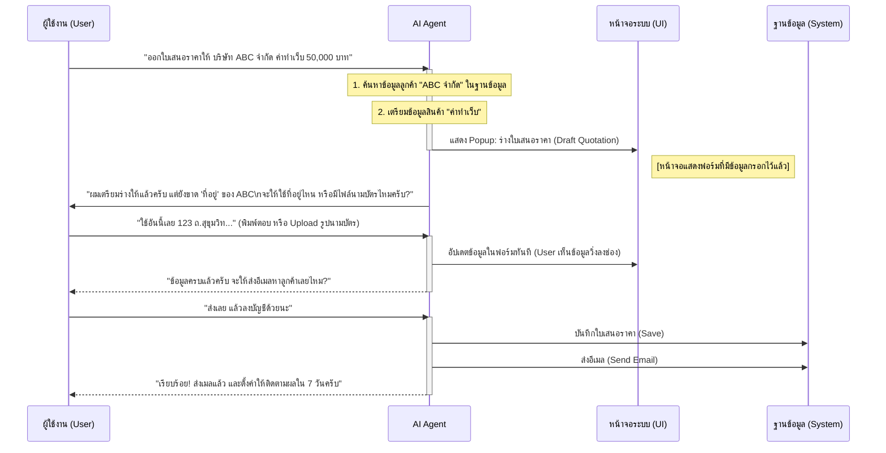
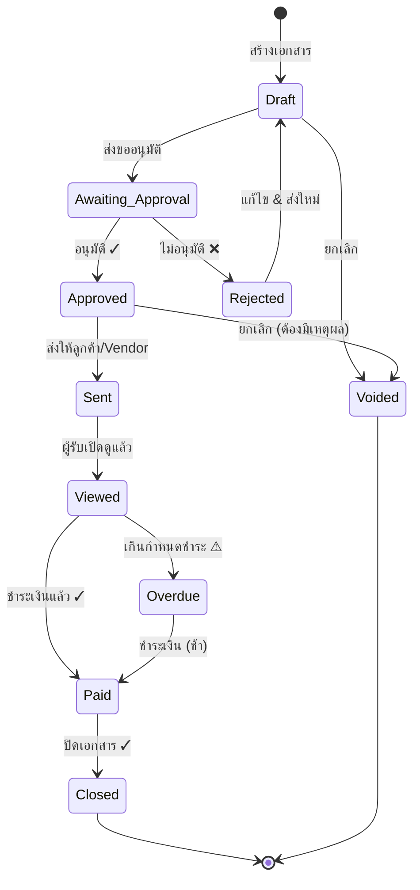

# Core System Workflows (แผนภาพกระบวนการทำงานหลัก)

เอกสารนี้แสดง Flow การทำงานของระบบบัญชีที่ออกแบบมาให้ "ง่าย" สำหรับผู้ใช้ แต่ "ครบ" ตามหลักการบัญชี

---

## 0. Onboarding Flow: เริ่มต้นใช้งานครั้งแรก (First Time Setup)
*Concept: ตั้งค่าจบใน 3 นาที ไม่ต้องรู้เรื่องบัญชีก็ใช้ได้*

```mermaid
graph TD
    A[Start: สมัครสมาชิกสำเร็จ] --> B[Welcome Screen<br/>"ยินดีต้อนรับ! มาตั้งค่าธุรกิจกันเถอะ"]
    
    B --> C[Step 1: เลือกประเภทธุรกิจ<br/>☕ คาเฟ่ | 🏭 โรงงาน | 💻 ฟรีแลนซ์ | 🛒 ขายของ]
    C --> D[ระบบเลือกผังบัญชีและ Template ให้อัตโนมัติ]
    
    D --> E[Step 2: กรอกข้อมูลบริษัท<br/>ชื่อ, ที่อยู่, เลขผู้เสียภาษี]
    E --> F{จด VAT หรือยัง?}
    F -- ยังไม่จด -- --> G1[ปิดระบบ VAT]
    F -- จดแล้ว -- --> G2[เปิดระบบ VAT 7%]
    
    G1 --> H[Step 3: อัปโหลด Logo<br/>(ข้ามได้)]
    G2 --> H
    
    H --> I[Step 4: เพิ่มบัญชีธนาคาร<br/>(สำหรับรับ/จ่ายเงิน)]
    
    I --> J[🎉 Setup Complete!<br/>"พร้อมใช้งานแล้ว"]
    J --> K{ต้องการทำอะไรต่อ?}
    
    K --> L1[สร้างใบเสนอราคาใบแรก]
    K --> L2[นำเข้าข้อมูลจากระบบเดิม]
    K --> L3[ดู Tutorial วิธีใช้งาน]
```

---

## 1. วงจรรายได้ (Revenue & Receivable Flow)
*Concept: เปลี่ยนจากใบเสนอราคาเป็นเงินสด โดยระบบบันทึกบัญชีให้อัตโนมัติทุกขั้นตอน*

```mermaid
graph TD
    A[Start: ลูกค้าสนใจสินค้า] --> B(สร้างใบเสนอราคา / Quotation)
    B --> C{ลูกค้าอนุมัติ?}
    C -- ไม่ -- --> D[ติดตามสถานะ / แก้ไข]
    C -- ใช่ -- --> E[เปลี่ยนเป็น ใบแจ้งหนี้ / Invoice<br/>*One-Click Convert*]
    E --> F{บันทึกบัญชีอัตโนมัติ<br/>Dr. ลูกหนี้ / Cr. รายได้}
    E --> G[ส่ง Link เอกสารให้ลูกค้าทาง LINE/Email]
    G --> H[ลูกค้าชำระเงิน]
    H --> I[บันทึกรับชำระ / Receipt<br/>*ตัดยอดลูกหนี้อัตโนมัติ*]
    I --> J{บันทึกบัญชีอัตโนมัติ<br/>Dr. เงินสด / Cr. ลูกหนี้}
    J --> K[ออกใบกำกับภาษี / Tax Invoice]
    K --> L[ระบบดึงลงรายงานภาษีขาย ภ.พ.30]
```

---

## 2. วงจรรายจ่าย (Expense & Payable Flow)
*Concept: ถ่ายรูป/Forward Email แล้วจบ (Zero Data Entry)*

```mermaid
graph TD
    A[Start: มีค่าใช้จ่าย] --> B{ประเภทเอกสาร?}
    B -- ใบเสร็จย่อย/สลิป 7-11 -- --> C[ถ่ายรูป / Upload เข้า Mobile App]
    B -- ใบแจ้งหนี้จาก Vendor -- --> D[Forward Email เข้าระบบ]
    
    C --> E[AI OCR: อ่านวันที่, ร้านค้า, ยอดเงิน]
    D --> E
    
    E --> F[สร้างใบสำคัญจ่ายรออนุมัติ<br/>Draft Voucher]
    F --> G{หัวหน้าอนุมัติ?}
    G -- ไม่ -- --> H[ส่งกลับแก้ไข]
    G -- ใช่ -- --> I[อนุมัติ & บันทึกบัญชี<br/>Dr. ค่าใช้จ่าย / Cr. เจ้าหนี้]
    
    I --> J[การเงินจ่ายชำระ]
    J --> K[บันทึกจ่ายเงิน<br/>Dr. เจ้าหนี้ / Cr. เงินฝากธนาคาร]
    K --> L[ระบบดึงลงรายงานภาษีซื้อ (ถ้ามี VAT)]
    K --> M[ระบบดึงลง 50 ทวิ (ถ้าเป็นค่าบริการ)]
```

---

## 3. วงจรปิดสิ้นเดือน (Month-End Closing)
*Concept: เปลี่ยนเรื่องปวดหัวให้เป็น Checklist ง่ายๆ พร้อม Health Score*

```mermaid
graph TD
    A[Start: สิ้นเดือน] --> B[ระบบสร้าง Closing Checklist]
    
    B --> C1[1. กระทบยอดธนาคาร<br/>Import Statement -> Match ยอด]
    B --> C2[2. ตรวจสอบภาษี<br/>VAT & WHT Report]
    B --> C3[3. คำนวณค่าเสื่อม & เงินเดือน<br/>(ระบบทำให้ Auto)]
    
    C1 --> D{ยอดตรงกันหมด?}
    C2 --> D
    C3 --> D
    
    D -- ไม่ตรง -- --> E[แจ้งเตือนจุดผิดพลาดให้แก้ไข]
    D -- ตรงแล้ว -- --> F[Lock งวดบัญชี]
    
    F --> G[ออกงบการเงิน<br/>งบดุล / งบกำไรขาดทุน]
    G --> H[คำนวณ Business Health Score ใหม่]
    H --> I[Dashboard: แจ้งเตือนสถานะบริษัท<br/>"เดือนนี้กำไรพุ่ง! เยี่ยมมาก"]
```

## 5. AI Agent Flow: ผู้ช่วยอัจฉริยะ (Conversational Action)
*Concept: สั่งงานด้วยภาษาธรรมชาติ -> AI ทำให้ดูสดๆ ที่หน้าจอ (Generative UI)*



### ตัวอย่าง UI Interaction (สิ่งที่ผู้ใช้เห็น)
1.  **Floating Chat Widget:** มุมล่างขวามีปุ่ม AI เสมอ กดเพื่อพูดหรือพิมพ์
2.  **Live Action:** เมื่อสั่งงาน หน้าจอจะ **เปลี่ยน** ไปยังหน้านั้นๆ จริงๆ (เช่น สั่งออกบิล ก็จะพาไปหน้าบิล) และเห็น Cursor หรือข้อมูลถูกพิมพ์ลงไปทีละช่องเหมือนมีผีมาพิมพ์ให้
3.  **Transparency:** AI จะบอกเสมอว่า "กำลังค้นหาข้อมูล...", "กำลังบันทึก..." เพื่อให้ผู้ใช้มั่นใจ

## 6. ฟีเจอร์แก้ Pain Point: หัก ณ ที่จ่าย & แก้ไขเอกสาร (Smart Tax & Correction)

### 6.1 ระบบหัก ณ ที่จ่ายอัตโนมัติ (Auto-WHT Generation)
*Concept: บันทึกจ่ายครั้งเดียว ได้ครบทั้งลงบัญชี, 50 ทวิ, และแบบยื่นภาษี*

```mermaid
graph TD
    A[Start: บันทึกจ่ายค่าบริการ] --> B{มีหัก ณ ที่จ่าย?}
    B -- ไม่มี -- --> C[บันทึกปกติ]
    B -- มี (เช่น ค่าจ้าง 3%) -- --> D[เลือกประเภท: ค่าจ้างทำของ (3%)]
    
    D --> E[ระบบคำนวณยอดหักให้ทันที<br/>(ยอด 1,000 -> หัก 30 -> จ่ายจริง 970)]
    
    E --> F[กดบันทึก (Save)]
    F --> G1[GL: Dr. ค่าจ้าง / Cr. เงินสด / Cr. ภาษีหัก ณ ที่จ่ายรอนำส่ง]
    F --> G2[**Generate ใบ 50 ทวิ (PDF) ทันที**<br/>(รันเลขที่อัตโนมัติ)]
    F --> G3[Add to Report: เพิ่มลงในรายงาน ภ.ง.ด.3/53]
```

### 6.2 การแก้ไขเอกสารที่ปลอดภัย (Smart Correction Logic)
*Concept: ผิดแก้ได้ แต่ต้องตรวจสอบได้ (Audit Trail)*

```mermaid
graph TD
    A[Start: ต้องการแก้ไขเอกสาร] --> B{เอกสารนี้ถูกปิดงบ/ยื่นภาษีหรือยัง?}
    
    B -- ยังไม่ปิด (Safe Period) -- --> C[อนุญาตให้แก้ไข (Edit Direct)]
    C --> D[ระบบปรับปรุง GL และยอดต่างๆ ให้อัตโนมัติ]
    C --> E[บันทึก Log ว่าใครแก้ แก้จากอะไรเป็นอะไร]
    
    B -- ปิดงบ/ยื่นภาษีแล้ว (Locked) -- --> F[**ไม่อนุญาตให้แก้ทับ**]
    F --> G[เสนอทางเลือก: **Void & Reissue**]
    
    G --> H1[1. ระบบสร้างรายการยกเลิก (Reversal Entry)<br/>(ล้างรายการเก่าออก)]
    G --> H2[2. สร้างเอกสารใบใหม่ (Clone ข้อมูลเดิมมาให้แก้)]
    G --> H3[3. ผู้ใช้แก้ไขข้อมูลในใบใหม่ -> Save]
    
    H3 --> I[ระบบเชื่อมโยงเอกสารเก่า-ใหม่ ให้ตรวจสอบย้อนหลังได้]
```

---

## 4. วิสัยทัศน์: ความง่ายที่ซ่อนความซับซ้อน (User vs System View)

| User Action (สิ่งที่ผู้ใช้ทำ) | System Action (สิ่งที่ระบบทำให้หลังบ้าน) |
| :--- | :--- |
| **"ออกบิลขายให้ลูกค้า A 10,000 บาท"** | 1. เช็คว่าลูกค้า A มีในระบบไหม<br>2. รันเลขที่เอกสาร INV-202310-001<br>3. บันทึก Dr. ลูกหนี้ / Cr. รายได้ขาย<br>4. บันทึกภาษีขายรอเรียกเก็บ |
| **"ถ่ายรูปสลิปค่าน้ำมัน 500 บาท"** | 1. OCR อ่านวันที่/ยอดเงิน<br>2. เดาผังบัญชี "ค่าพาหนะ"<br>3. บันทึก Dr. ค่าพาหนะ / Cr. เจ้าหนี้<br>4. แนบไฟล์รูปภาพเข้ากับ Transaction เก็บเข้า Cloud |
| **"จ่ายเงินเดือนพนักงาน"** | 1. คำนวณประกันสังคม/ภาษีหัก ณ ที่จ่าย<br>2. ออกสลิปเงินเดือน<br>3. สร้างไฟล์ยื่นธนาคาร<br>4. บันทึกบัญชีเงินเดือนและหนี้สินที่เกี่ยวข้อง |

---

## 7. Invoice to Collection Flow: จากออกบิลจนเก็บเงินได้
*Concept: ติดตามทุกขั้นตอนจนเงินเข้าบัญชี ไม่มีตกหล่น*

```mermaid
graph TD
    A[Start: สร้างใบแจ้งหนี้] --> B[ส่งให้ลูกค้า<br/>Email / LINE / Print]
    B --> C[ระบบติดตามสถานะ: Sent ✓]
    
    C --> D{ลูกค้าเปิดดู?}
    D -- ยัง -- --> E[แจ้งเตือน: "ลูกค้ายังไม่เปิดดู 3 วันแล้ว"<br/>-> กดส่งซ้ำ?]
    D -- เปิดแล้ว -- --> F[สถานะ: Viewed ✓]
    
    F --> G{ใกล้ครบกำหนด?}
    G -- 3 วันก่อน Due -- --> H[แจ้งเตือนลูกค้าอัตโนมัติ<br/>"บิลใกล้ครบกำหนดแล้วนะคะ"]
    G -- ยังไม่ใกล้ -- --> I[รอ...]
    
    H --> J{ลูกค้าจ่ายเงิน?}
    I --> J
    
    J -- จ่ายแล้ว -- --> K[บันทึกรับชำระเงิน]
    K --> L{มีหัก ณ ที่จ่าย?}
    L -- มี -- --> M[บันทึก WHT + เตือนให้ทวงใบ 50 ทวิตัวจริง]
    L -- ไม่มี -- --> N[ปิดบิล สถานะ: Paid ✓]
    M --> N
    
    J -- ยังไม่จ่าย & เกิน Due -- --> O[สถานะ: Overdue ❌<br/>แจ้งเตือนเจ้าของ]
    O --> P[ระบบแนะนำ: โทรทวง / ส่ง Reminder]
    P --> J
```

---

## 8. Payroll Flow: จ่ายเงินเดือนจนยื่นภาษีครบ
*Concept: กดครั้งเดียว ได้ครบทั้งสลิป, ไฟล์ธนาคาร, และแบบยื่นภาษี*

```mermaid
graph TD
    A[Start: สิ้นเดือน] --> B[เข้าหน้า Payroll]
    
    B --> C[ระบบดึงข้อมูลพนักงานทั้งหมด<br/>+ คำนวณเงินเดือนให้อัตโนมัติ]
    
    C --> D{มีข้อมูลเวลาเข้างาน?}
    D -- มี -- --> E[Import ไฟล์สแกนนิ้ว<br/>หักขาด/ลา/สาย อัตโนมัติ]
    D -- ไม่มี -- --> F[ใช้เงินเดือนเต็ม]
    
    E --> G[ตรวจสอบยอดสุทธิ<br/>เงินเดือน - ประกันสังคม - ภาษี]
    F --> G
    
    G --> H{ยอดถูกต้อง?}
    H -- แก้ไข -- --> I[ปรับรายการพิเศษ<br/>OT, โบนัส, หักเงินกู้]
    I --> G
    
    H -- ถูกต้อง -- --> J[กด "อนุมัติจ่ายเงินเดือน"]
    
    J --> K1[1. สร้าง e-Payslip ทุกคน<br/>ส่ง Email/LINE อัตโนมัติ]
    J --> K2[2. สร้างไฟล์โอนเงินธนาคาร<br/>พร้อม Upload]
    J --> K3[3. สร้างไฟล์ยื่นประกันสังคม (1-10)]
    J --> K4[4. สร้างรายงาน ภ.ง.ด.1]
    J --> K5[5. บันทึกบัญชีเงินเดือน<br/>Dr.เงินเดือน / Cr.เงินสด+ภาษี+ประกันสังคม]
    
    K1 --> L[Done! ✓ จ่ายเงินเดือนเสร็จสิ้น]
    K2 --> L
    K3 --> L
    K4 --> L
    K5 --> L
```

---

## 9. Tax Filing Flow: ยื่นภาษีประจำเดือน
*Concept: ระบบเตรียมทุกอย่างให้ แค่ตรวจสอบแล้วกด Submit*

```mermaid
graph TD
    A[Start: ต้นเดือนใหม่] --> B[แจ้งเตือน: "ถึงเวลายื่นภาษีเดือนที่แล้ว"]
    
    B --> C[เข้าหน้า Tax Center]
    C --> D[ระบบแสดง Checklist ภาษีที่ต้องยื่น]
    
    D --> E1[📋 ภ.พ.30 - VAT<br/>กำหนด: วันที่ 15]
    D --> E2[📋 ภ.ง.ด.3 - WHT บุคคล<br/>กำหนด: วันที่ 7]
    D --> E3[📋 ภ.ง.ด.53 - WHT นิติบุคคล<br/>กำหนด: วันที่ 7]
    D --> E4[📋 ประกันสังคม<br/>กำหนด: วันที่ 15]
    
    E1 --> F1[ระบบรวมยอดภาษีซื้อ/ขาย<br/>จากเอกสารทั้งเดือน]
    E2 --> F2[ระบบรวม 50 ทวิที่ออกให้บุคคล]
    E3 --> F3[ระบบรวม 50 ทวิที่ออกให้นิติบุคคล]
    E4 --> F4[ระบบรวมยอดประกันสังคมพนักงาน]
    
    F1 --> G{ตรวจสอบยอด}
    F2 --> G
    F3 --> G
    F4 --> G
    
    G -- ถูกต้อง -- --> H[กด "Export ไฟล์ยื่น"]
    H --> I[ดาวน์โหลดไฟล์ + เปิดหน้าเว็บสรรพากร/ประกันสังคม]
    I --> J[Upload ไฟล์ & ยืนยัน]
    J --> K[กลับมากด "ยื่นแล้ว" ในระบบ<br/>บันทึกวันที่ยื่น + เลขอ้างอิง]
    K --> L[สถานะ: Filed ✓]
    
    G -- มีข้อผิดพลาด -- --> M[ระบบแจ้ง: "ยอดไม่ตรง เอกสารขาด X รายการ"]
    M --> N[แก้ไขเอกสารที่ต้นทาง]
    N --> G
```

---

## 10. Bank Reconciliation Flow: กระทบยอดธนาคาร
*Concept: Import Statement แล้วระบบจับคู่ให้อัตโนมัติ*

```mermaid
graph TD
    A[Start: ได้รับ Bank Statement] --> B[Import ไฟล์ CSV/Excel<br/>หรือเชื่อม Bank API]
    
    B --> C[ระบบอ่านรายการเงินเข้า/ออก<br/>จาก Statement]
    
    C --> D[Auto-Matching:<br/>จับคู่กับรายการในระบบอัตโนมัติ]
    
    D --> E{ผลการจับคู่}
    
    E -- Matched ✓ -- --> F[รายการที่ตรงกัน<br/>(เช่น รับเงินจากลูกค้า A)]
    E -- Unmatched ❓ -- --> G[รายการที่ยังไม่ตรง]
    
    F --> H[กด Confirm เพื่อยืนยัน]
    
    G --> I{ประเภทรายการ?}
    I -- รู้ว่าคืออะไร -- --> J[เลือกจับคู่กับเอกสารที่มี<br/>หรือสร้างรายการใหม่]
    I -- ไม่รู้/ถามหลังบ้าน -- --> K[กด "Flag for Review"<br/>ส่งให้นักบัญชีตรวจสอบ]
    
    J --> H
    K --> L[นักบัญชีตรวจสอบ & จัดการ]
    L --> H
    
    H --> M{ยอดตรงกันหมด?}
    M -- ยังไม่ตรง -- --> N[แสดงยอดส่วนต่าง<br/>"ยอดในระบบ vs ยอด Bank"]
    N --> O[ตรวจสอบ & แก้ไข]
    O --> M
    
    M -- ตรงแล้ว ✓ -- --> P[กด "Complete Reconciliation"]
    P --> Q[บันทึก Reconciliation Report<br/>Lock งวดบัญชี]
```

---

## 11. Quick Actions: ทางลัดสำหรับงานที่ทำบ่อย
*Concept: เข้าถึงงานหลักได้ใน 1-2 คลิก*

```mermaid
graph LR
    A[🏠 หน้า Dashboard] --> B{Quick Action Buttons}
    
    B --> C1[➕ สร้างใบเสนอราคา]
    B --> C2[➕ บันทึกค่าใช้จ่าย]
    B --> C3[💰 บันทึกรับเงิน]
    B --> C4[📤 ส่งใบแจ้งหนี้]
    B --> C5[🤖 ถาม AI Assistant]
    
    C1 --> D1[ไปหน้าสร้าง Quotation<br/>พร้อมแนะนำลูกค้าล่าสุด]
    C2 --> D2[Popup บันทึกค่าใช้จ่าย<br/>+ ปุ่มถ่ายรูปสลิป]
    C3 --> D3[แสดงรายการบิลค้างรับ<br/>กดเลือก -> กรอกยอดรับ]
    C4 --> D4[แสดงบิลที่ยังไม่ส่ง<br/>กด Send ได้เลย]
    C5 --> D5[เปิด Chat พิมพ์คำสั่ง<br/>"สรุปยอดขายวันนี้"]
```

---

## 12. Document Lifecycle: วงจรชีวิตเอกสาร (Status Tracking)
*Concept: รู้สถานะเอกสารทุกใบตลอดเวลา*



### Status Color Coding:
| สถานะ | สี | ความหมาย |
|-------|-----|---------|
| Draft | ⚪ เทา | ยังไม่เสร็จ |
| Awaiting Approval | 🟡 เหลือง | รออนุมัติ |
| Approved/Sent | 🔵 น้ำเงิน | ดำเนินการแล้ว |
| Viewed | 🟣 ม่วง | ผู้รับเปิดดูแล้ว |
| Paid/Closed | 🟢 เขียว | สำเร็จ |
| Overdue | 🔴 แดง | เกินกำหนด/มีปัญหา |
| Voided | ⚫ ดำ | ยกเลิก |


